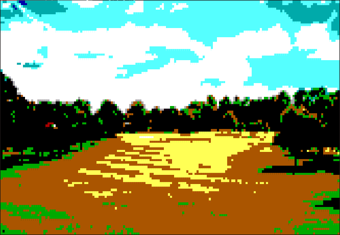

# waterImage
Quickly convert image to high quality ascii

I have create this package for the Water Panther WebBrowser project.

## Usage
You need nodejs to run it
           
You just have to run `node img imageName.png`

After the image name you can precise the image depth, between 2 and 8. Lower values are quick, higher value are more pretty. By default it is 4, the better quality/sp
eed ratio.

# Important to know
This package is made to be used in console. The ascii image can only be rendered in a console, because of using terminal color tags.

This package work with jpg, png, gif (for gif you need to precise wich frame need to be converted, by adding `[x]`, where `x` is the frame number (starting at 0) after the filename)

# Why the image quality is good
This script take advantage on the others ascii converters because it use a special char who take the bottom of the character space, and let see the background color on top of the character place. That let me able to show two color per character place. That give better quality because that let us able to have twice more "pixels" in height :-)

become

become

become

